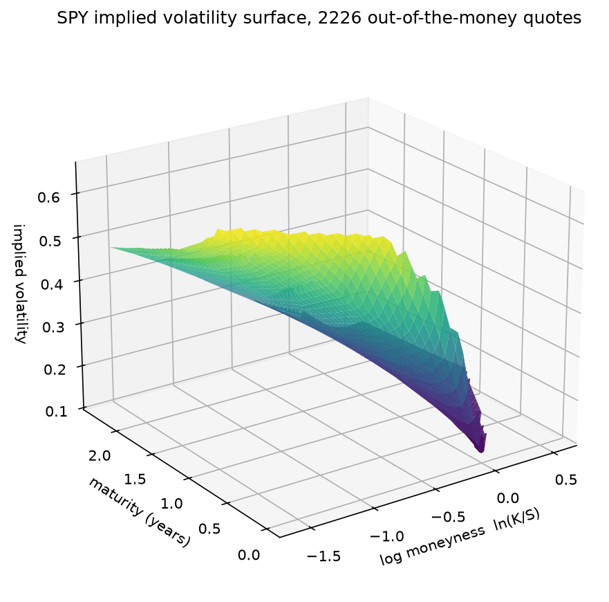
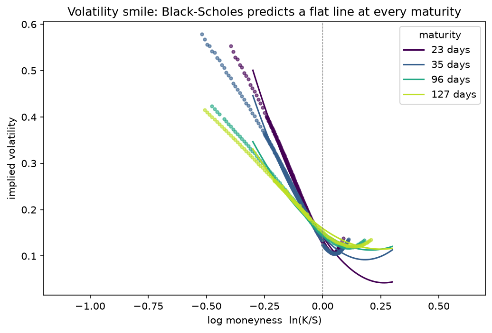
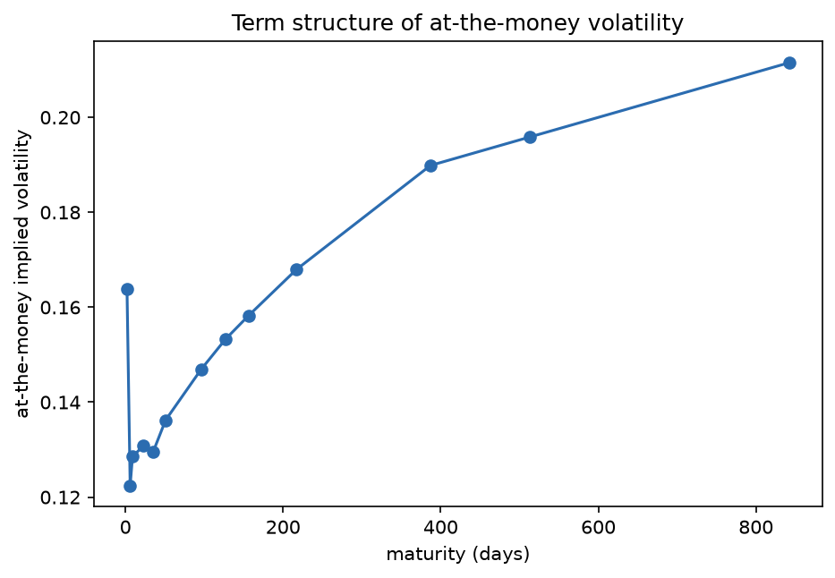

# Implied Volatility Surface

Recovering the volatility surface from live option quotes, and using it to measure how far real markets depart from the model that is supposed to price them.

Black-Scholes assumes a single constant volatility for every strike and every maturity of the same underlying. Inverting the formula against real quotes recovers what volatility the market must be pricing in for each contract. If the assumption held, that number would be identical everywhere. It is not, and the size and shape of the discrepancy is the result reported here.

## Method

**Inverting the pricing formula.** There is no closed form for volatility given a price, so it is solved numerically. Newton-Raphson converges quadratically because vega is available analytically, but it is unreliable in the wings, where vega approaches zero and a single step can jump outside any sensible range. The solver therefore falls back to Brent's method on a bracketed interval, which cannot diverge: option price is strictly monotone in volatility, a property verified by a test.

**Screening.** Raw chains are mostly noise. Contracts are dropped unless they have a positive bid, at least 10 contracts of open interest, a relative bid-ask spread under 25 percent, and more than one day to expiry. Quotes are then restricted to out-of-the-money contracts, for a measured reason given below.

**Data.** SPY option chains from Yahoo Finance, 14 expirations sampled evenly across the full listed range rather than taken consecutively, which reaches 842 days instead of stopping at the front-month weeklies. 5,277 raw quotes, 3,609 surviving liquidity screening, 2,226 out-of-the-money quotes across 13 maturities.

## Validation

32 tests across three levels.

**Against no-arbitrage relations on real quoted prices.** Rearranging put-call parity gives a forward price implied by quotes alone, `F = C - P + K*exp(-rT)`. Every strike at a given maturity must imply the same forward, whatever the true interest rate and dividend yield happen to be, so their agreement tests the data without assuming either input. Measured cross-strike dispersion: **0.039 percent**.

Checking parity directly, with an assumed rate and dividend yield, leaves a residual that grows with maturity: 0.088 percent of spot inside three months against 0.74 percent beyond a year. That pattern is the signature of a wrong assumed rate rather than an arbitrage, since parity carries the discount factors exp(-rT) and exp(-qT) and amplifies any error in them linearly in maturity. A test asserts this scaling explicitly, which is also why the forward-consistency check, assuming neither input, is the one that actually constrains the quotes.

**Against an independent implementation.** Recovered volatilities are compared with the data provider's own published figures: median absolute difference **0.0123**, 95th percentile 0.0360.

**Against known analytic properties.** Round-trip recovery of the volatility used to price a contract, monotonicity of price in volatility, vega matching a numerical derivative, put-call parity holding identically in the formula, and deep in-the-money prices converging to their forward value.

### Why out-of-the-money quotes only

This is a screening rule justified by measurement rather than convention. A deep in-the-money option is almost entirely intrinsic value, so its vega collapses and its price stops responding to volatility. Inverting such a quote amplifies noise into implausible numbers.

The effect is quantified in the test suite. Running the same comparison against the provider on in-the-money quotes gives a 95th-percentile disagreement of **0.124**, against **0.036** for out-of-the-money ones, roughly a factor of three worse in the tail.

The limit is fundamental rather than algorithmic. A test prices a 25-percent-in-the-money call at volatilities anywhere from 5 to 25 percent and asserts the resulting prices differ by less than `1e-12`. No inversion method can recover a volatility from a price that does not depend on it.

## Results

**The surface is not flat.** Black-Scholes predicts a horizontal plane.



**Skew and curvature are systematic, not noise.** Fitting a quadratic in log-moneyness within 30 percent of at-the-money, at every one of 13 maturities:

| Maturity (days) | ATM level | Skew | Curvature |
|---|---|---|---|
| 2 | 0.160 | -0.941 | 32.34 |
| 6 | 0.122 | -0.886 | 10.96 |
| 9 | 0.133 | -0.873 | 5.38 |
| 23 | 0.143 | -0.761 | 1.44 |
| 35 | 0.143 | -0.555 | 1.52 |
| 51 | 0.143 | -0.453 | 1.39 |
| 96 | 0.152 | -0.377 | 0.91 |
| 127 | 0.160 | -0.357 | 0.71 |

Skew is negative at **100 percent** of maturities and curvature positive at **92 percent**, against a model prediction of exactly zero for both. Within a single maturity, implied volatility spans **0.433** from one strike to another at the median.



The shape is the equity index skew: downside puts price at far higher implied volatility than upside calls. Markets charge a premium for crash protection that a lognormal model has no way to express.

**Skew decays with maturity**, from -0.94 at 2 days to -0.36 at 127 days, monotonically. Over longer horizons the aggregate return distribution looks progressively more lognormal, which is what a central-limit argument predicts and what the fitted coefficients independently reproduce here.

**The term structure of at-the-money volatility slopes upward**, from 0.164 at 2 days to 0.212 at 842 days.



## Layout

```
volsurface/
    black_scholes.py   pricing, vega, no-arbitrage bounds
    implied_vol.py     Newton-Raphson with a bracketed fallback
    chain.py           download, liquidity and moneyness screening
    smile.py           per-maturity skew and curvature, term structure
tests/                 analytic properties, round trips, real-quote arbitrage checks
fetch_data.py          refresh the cached chain from Yahoo Finance
analyze.py             build the surface and report the statistics above
```

## Running it

```bash
python -m venv .venv
.venv/bin/pip install -r requirements.txt
.venv/bin/python -m pytest -q
.venv/bin/python analyze.py
```

The cached chain is committed, so the analysis reproduces without a network call. `fetch_data.py` refreshes it against the current market.
