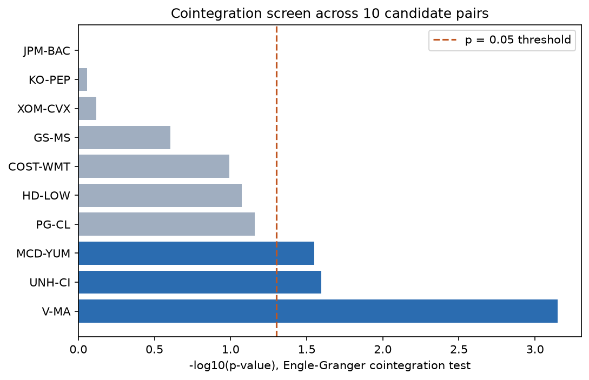
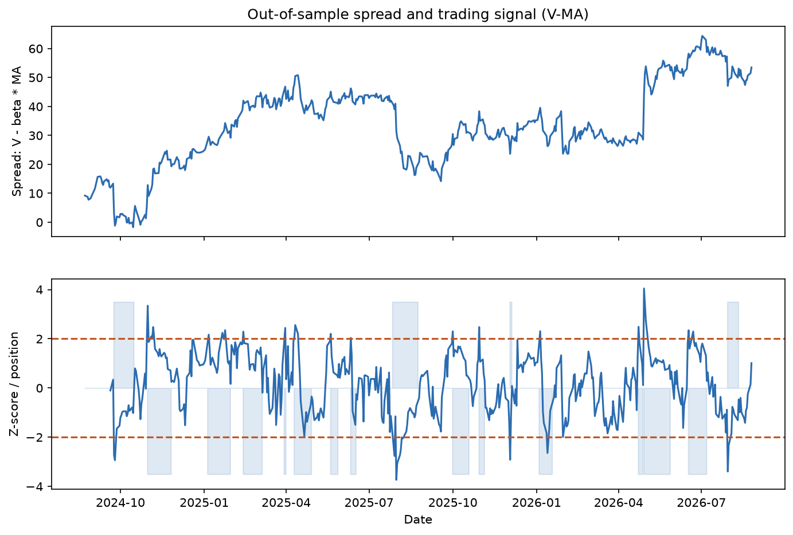
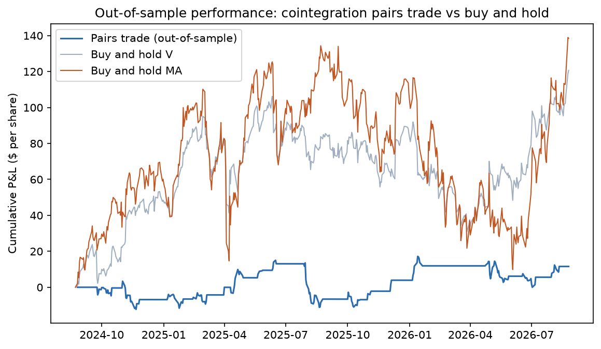

# Statistical Arbitrage: Cointegration-Based Pairs Trading

A systematic cointegration screen across ten real equity pairs, followed by an out-of-sample backtest of the strongest candidate, built to demonstrate the actual methodology of pairs trading rather than assume it works on any two similar-looking stocks.

## Method

For two price series to support a mean-reverting pairs trade, they must be cointegrated: a linear combination of the two must be stationary, even though each series individually is not (Engle & Granger, Econometrica 55(2), 251-276, 1987). The two-step test used here:

1. Regress price A on price B by OLS to get the hedge ratio.
2. Test the regression residual (the spread) for a unit root with the Augmented Dickey-Fuller test.

A pair is only considered tradeable if the ADF p-value is below 0.05. The mean-reversion speed of a cointegrated spread is estimated separately from an Ornstein-Uhlenbeck fit, giving a half-life in trading days (Chan, Algorithmic Trading, 2013).

Ten candidate pairs from sectors with a plausible shared business driver (payment networks, healthcare insurers, quick-service restaurants, oil majors, banks, retailers, consumer staples) are screened on the first 60% of five years of real daily price data. The hedge ratio is fixed from this training period and the trading strategy is backtested strictly on the held-out final 40%, to avoid look-ahead bias.

## Results

Only 3 of 10 candidate pairs are statistically cointegrated in-sample: superficially similar businesses (Coca-Cola/Pepsi, ExxonMobil/Chevron, Goldman Sachs/Morgan Stanley) do not automatically share a stable price relationship.

| Pair | ADF p-value | Cointegrated |
|---|---|---|
| V-MA | 0.0007 | Yes |
| UNH-CI | 0.0254 | Yes |
| MCD-YUM | 0.0282 | Yes |
| PG-CL, HD-LOW, COST-WMT, GS-MS, XOM-CVX, KO-PEP, JPM-BAC | 0.07-1.00 | No |



Visa and Mastercard show the strongest cointegration (p = 0.0007), a plausible result given their near-duopoly in card payment networks. Hedge ratio 0.552, mean-reversion half-life 17.9 trading days.

Backtesting the V-MA spread out-of-sample (502 trading days, entry at |z| > 2, exit at |z| < 0.5, 5 bps transaction cost per trade):

| Metric | Value |
|---|---|
| Total P&L | 11.57 $/share |
| Sharpe ratio | 0.28 |
| Max drawdown | -26.16 $/share |
| Position changes | 196 |




The out-of-sample Sharpe ratio is modest, and the spread itself drifts well beyond its training-period range, consistent with the well-documented decay of pairs-trading edges after the strategy became widely known (a follow-up finding to Gatev, Goetzmann & Rouwenhorst, Rev. Financ. Stud. 19(3), 797-827, 2006). The equity curve is a P&L in dollars per share, market-neutral by construction, so it is not directly comparable to the buy-and-hold return of either leg; it is shown for context, not as a like-for-like benchmark.

## Contents

- `src/cointegration.py`: hedge ratio, Engle-Granger test, Ornstein-Uhlenbeck half-life
- `src/screening.py`: batch cointegration screening across a candidate universe
- `src/backtest.py`: z-score signal generation, backtest engine with transaction costs, performance metrics
- `data/fetch_price_data.py`: reproducible fetch of real price data
- `tests/`: validates the ADF test against a known synthetic stationary process, and the screening result against the real V-MA and KO-PEP cases

## Running it

```bash
python -m venv .venv
.venv/bin/pip install -r requirements.txt
.venv/bin/python -m data.fetch_price_data
.venv/bin/python -m pytest -q
.venv/bin/python -m analysis.run_analysis
```
